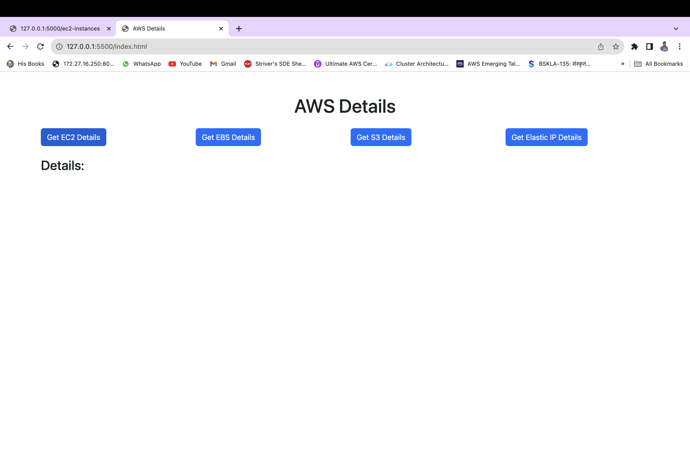
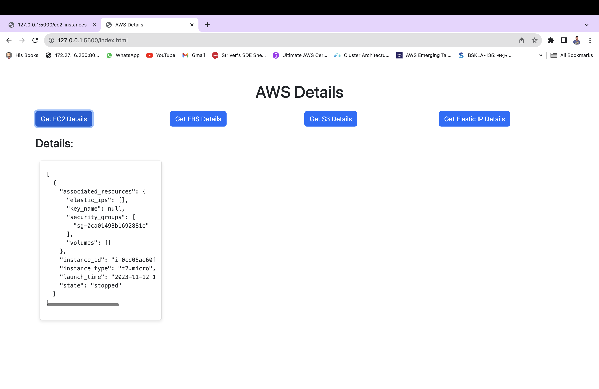
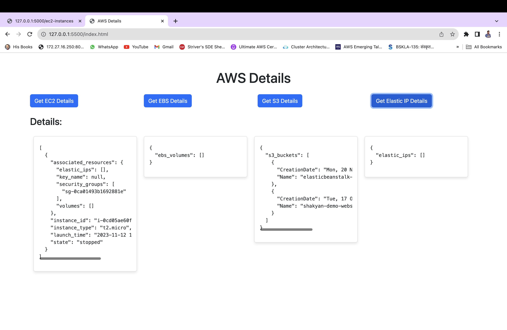

# AWS Details Project

This project involves creating a web application to fetch and display details about AWS resources using a frontend developed in HTML and a backend developed in Flask.

## HTML Frontend

The HTML frontend is responsible for providing a user interface and making requests to the backend for fetching AWS details. Here's an overview of the frontend:

### Structure

- **Head Section:** Contains metadata and the title of the webpage.

- **Body Section:**
  - **Heading (h1):** Displays the main title "AWS Details."
  - **Buttons:** Four buttons are provided, each triggering a specific function when clicked.
  - **Loader (div):** Displays a loading spinner while waiting for a response from the backend.
  - **Result Container (div):** Displays the fetched AWS details in cards.

### Styles

Custom styles are applied to format the buttons, loader, and result cards. The loader is initially hidden and becomes visible during API requests.

```css
#loader {
    /* Styles for the loader */
}

.card {
    border: 1px solid #ddd;
    padding: 15px;
    margin: 10px;
    border-radius: 5px;
    box-shadow: 0 4px 8px rgba(0, 0, 0, 0.1);
    width: 300px;
    display: inline-block;
    vertical-align: top;
    overflow: auto;
}

```

# JavaScript Code

The JavaScript code handles asynchronous data fetching and dynamically updates the DOM with the fetched AWS details. It uses the Fetch API for making requests to the Flask backend.

# Flask Backend

The Flask backend is responsible for handling incoming requests from the frontend, interacting with the AWS SDK (boto3), and returning the requested AWS details. Here's an overview of the backend:

## Dependencies

- **Flask:** A micro web framework for Python.
- **boto3:** The official AWS SDK for Python.

## AWS Credentials

For `boto3` to interact with AWS services, it requires valid AWS credentials. These credentials typically include an AWS Access Key ID and an AWS Secret Access Key. It's crucial to securely manage and protect these credentials. It is stored in `~/.aws/credentials` file for Mac/Linux and `C:\Users\USERNAME\.aws\credentials` for Windows.


## Endpoints

- **`/ec2-instances` (GET):** Retrieves details about EC2 instances.
- **`/ebs-volumes` (GET):** Retrieves details about EBS volumes.
- **`/s3-buckets` (GET):** Retrieves details about S3 buckets.
- **`/elastic-ips` (GET):** Retrieves details about Elastic IPs.

## Functions

- **`get_ec2_instances():`** Retrieves and returns details about EC2 instances.
- **`get_ebs_volumes():`** Retrieves and returns details about EBS volumes.
- **`get_s3_buckets():`** Retrieves and returns details about S3 buckets.
- **`get_elastic_ips():`** Retrieves and returns details about Elastic IPs.

## CORS Handling

CORS (Cross-Origin Resource Sharing) is handled using the Flask-CORS extension to allow requests from the frontend.

## How It Works

1. The user clicks one of the buttons on the HTML page to request specific AWS details.
{:class="img-fluid rounded border border-primary"}

2. The JavaScript code makes an asynchronous fetch request to the corresponding Flask endpoint.
3. The Flask backend processes the request, interacts with AWS services using boto3, and returns the requested details.
{:class="img-fluid rounded border border-primary"}

4. The JavaScript code receives the response, updates the DOM to display the details in a card format, and hides the loader.
{:class="img-fluid rounded border border-primary"}
This project demonstrates the interaction between a simple HTML frontend and a Flask backend to fetch and display AWS details dynamically.


